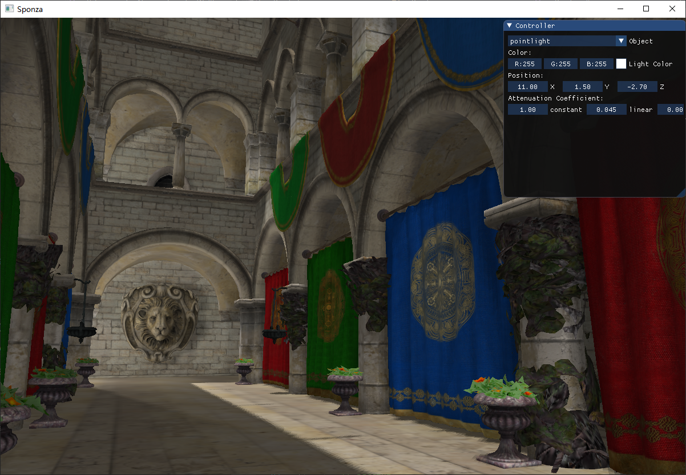
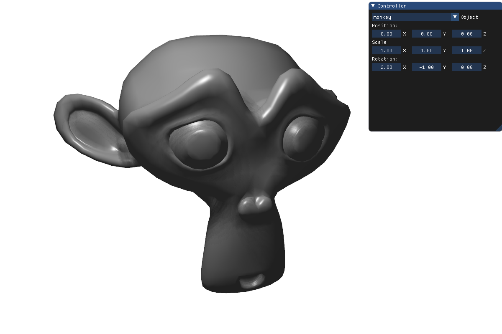

# EasyRenderEngine

**Not yet completed.**  

基于OpenGL实现了一个简易的可交互实时渲染引擎 

主要实现功能： 

-  摄像机模型 

    实时移动查看场景 

- 材质编辑 

    支持漫反射、高光等参数设置，支持纹理贴图、法线贴图、镜面贴图 

- 光照编辑 

    支持平行光、点光源设置、支持多光源与多光源阴影 

- Obj模型导入 

    支持obj模型及其贴图导入 

- 可编程着色器 

    支持自定义着色器 

- GUI编辑 

    支持实时GUI编辑模型、光照等 

- 其他 

    - 天空盒 
    - 

Note： 

默认操作： 

按住鼠标右键时，移动鼠标旋转镜头，wasd移动位置，鼠标滚轮控制移动速度

